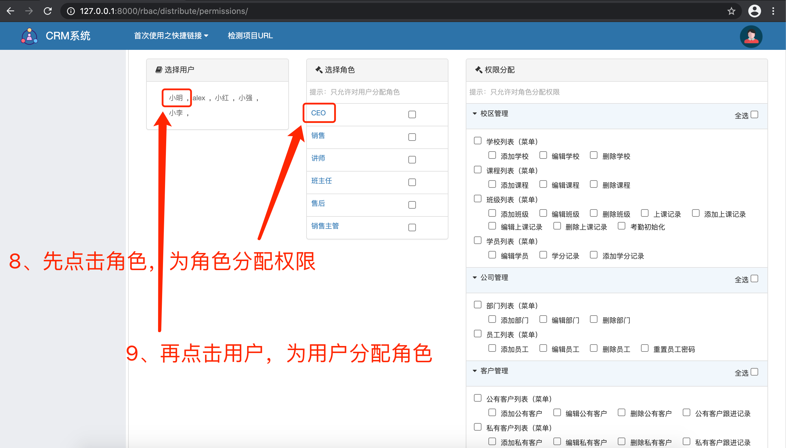
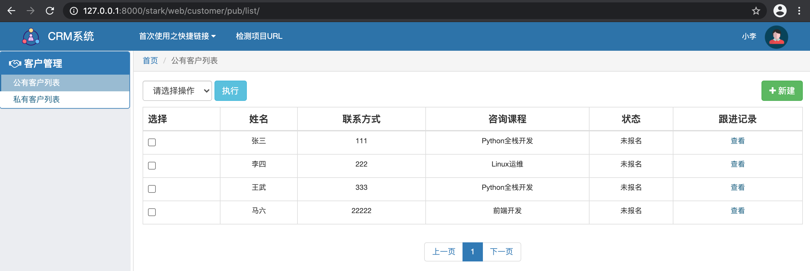

## CRM系统

### 1.[功能描述]
1. 对以下数据的基本增删改查管理
    * 菜单、角色、权限
    * 部门、员工、客户
    * 客户跟进记录、客户缴费记录
    * 学校、班级、课程、班主任、讲师、学员
    * 上课记录、考勤记录、学分
2. 支持角色管理，根据业务需求分出销售、销售主管、学员、讲师等角色
3. 支持权限分配
4. 允许销售创建、跟进客户信息，提交客户缴费申请
5. 允许销售主管签审缴费申请
6. 允许讲师提交上课记录、学员签到、学分设置

### 2.[开发环境]
1. 操作系统：macOS10.15.7
2. 解释器版本：python3.7.9
3. web框架：Django3.1.1

### 3.[项目结构简介]
1. crmProject
    * Project
2. rbac
    * App：通用的、达到对象级别的权限控制组件，且允许用户自定制权限
3. stark
    * App：通用的、可插拔式的增删改查组件
4. web
    * App：CRM业务
5. db.sqlite3
    * 数据库：仅做为示例
6. manage.py
7. README

### 4.[启动方式]
#### 方式一：使用示例sqlite数据库
1. pycharm直接运行，或终端输入`python3 manage.py runserver 127.0.0.1:8080`
2. 浏览器访问`http://127.0.0.1:8000/login/`，进行登录
3. 登录信息
    * 管理员账号：admin，密码：admin
    * 讲师账号：小强，密码：123
    * 班主任账号：小红，密码：123
    * 销售账号：小李，密码：123
    * 销售主管账号：小明，密码：123
#### 方式二：自建mysql数据库，需按以下方式初始化权限相关数据：
1. 开启mysql数据库
    * 创建一个新库以存放表
    ```mysql
    create database db_crm;
    ```
    * 修改`crmProject/settings.py`数据库连接配置
    ```python
    DATABASES = {
        'default': {
            'ENGINE': 'django.db.backends.mysql',
            'NAME': 'db_crm',  # 数据库名
            'USER': '****',  # mysql账号
            'PASSWORD': '******',  # mysql密码
            'HOST': '127.0.0.1',
            'PORT': 3306
        }
    }
    ```
2. 数据库迁移
```
python3 manage.py makemigrations
python3 manage.py migrate
```

##### 注：首次启动项目时，需要按照以下步骤操作：

1. 进入`crmProject/settings.py`，注释掉rbac组件的中间件权限校验
```python
MIDDLEWARE = [
    'django.middleware.security.SecurityMiddleware',
    'django.contrib.sessions.middleware.SessionMiddleware',
    'django.middleware.common.CommonMiddleware',
    'django.middleware.csrf.CsrfViewMiddleware',
    'django.contrib.auth.middleware.AuthenticationMiddleware',
    'django.contrib.messages.middleware.MessageMiddleware',
    'django.middleware.clickjacking.XFrameOptionsMiddleware',
    # 'rbac.middlewares.rbac.RbacMiddleware',
]
```
2. 进入`rbac/templates/layout.html`，注释掉左侧二级菜单和路径导航功能
```html
 <div class="pg-body">
    <!-- 左侧二级菜单 -->
    <div class="left-menu">
        <div class="menu-body">
{#            #}
        </div>
    </div>

    <!-- 右侧信息表格 -->
    <div class="right-body">

        <!-- 路径导航 -->
        <div>
{#            #}
        </div>

        <!-- 信息表格 -->
        

        
    </div>
</div>
```
3. 启动项目：pycharm直接运行，或终端输入`python3 manage.py runserver 127.0.0.1:8080`
4. 浏览器访问`http://127.0.0.1:8000/index/`，进行以下操作：



5. 完成以上操作后，进入项目恢复被注释的代码，并重新启动项目
6. 注销账户，或浏览器访问`http://127.0.0.1:8000/login/`，重新登录，以将带权限的用户权限等信息重新写入session
7. 至此，即可正常使用CRM系统，进行创建用户、角色、权限分配和客户关系管理等操作

### 5.[运行效果]
1. 基于角色的访问控制
* 销售

* 销售主管

* 班主任

* 讲师


* CEO、管理员


